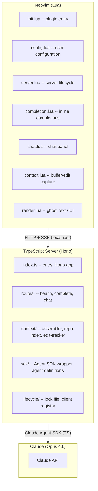
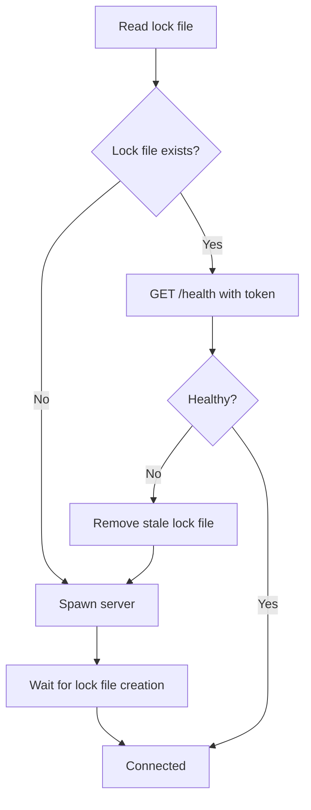
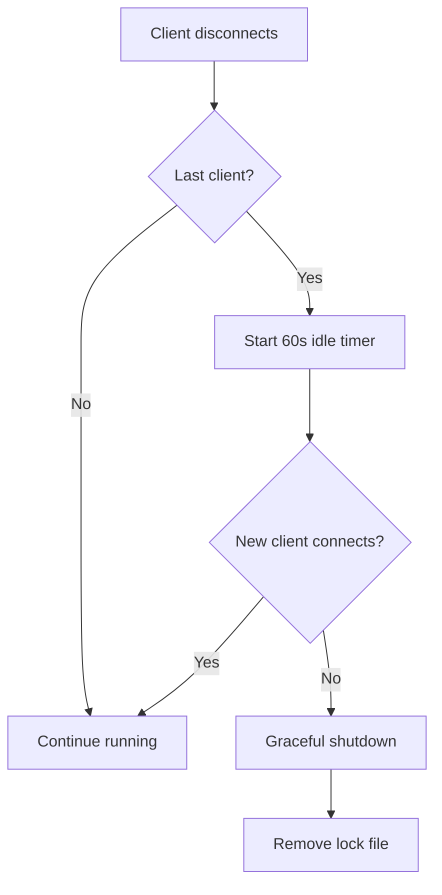

# Architecture

A Neovim plugin providing AI-powered code completion and chat using Claude via the Claude Agent SDK. Designed as a self-hosted alternative to Supermaven/Copilot for users with Claude Max subscriptions.

## Goals

- Inline code completions with ghost text rendering in Neovim
- Chat interface for asking questions about code
- Supermaven-inspired context strategy: repo indexing, edit tracking, prioritized context assembly
- Uses Claude Agent SDK (TypeScript) -- no direct API calls, no direct CLI invocation
- Works with Claude Max subscription (no API keys required)

## Non-Goals

- Real-time keystroke-level autocomplete (latency constraints make this impractical with Claude)
- Custom model training or fine-tuning
- Support for non-Claude providers
- LSP server implementation (we use HTTP + SSE, not the LSP protocol)

## System Architecture



## Communication

- **Protocol:** HTTP + Server-Sent Events (SSE) over localhost
- **Port:** Random available port, written to lock file
- **Serialization:** JSON request bodies, SSE event streams for responses
- **Authentication:** None (localhost only). Lock file contains auth token for multi-instance safety.

## Server Lifecycle

The first Neovim instance spawns the server. Subsequent instances discover and reuse it.

### Lock File

State file: `~/.local/state/bonk/server.lock`

```json
{
  "pid": 12345,
  "port": 8741,
  "token": "random-uuid",
  "started_at": "2026-03-20T10:00:00Z"
}
```

### Startup Flow



### Shutdown Flow



On `SIGTERM`/`SIGINT`, the server performs an immediate graceful shutdown and removes the lock file.

## Project Structure

```
bonk.nvim/
  lua/
    bonk/
      init.lua            -- setup(), plugin commands, public API
      config.lua          -- configuration schema, defaults, validation
      server.lua          -- spawn, discover, connect, health check
      completion.lua      -- trigger, SSE parse, accept/dismiss
      chat.lua            -- chat panel, input, message rendering
      context.lua         -- buffer tracking, edit diff capture
      render.lua          -- ghost text extmarks, highlight groups
      http.lua            -- HTTP client (curl via jobstart), SSE parser
      utils.lua           -- shared utilities
  server/
    src/
      index.ts            -- Hono app, route registration, startup
      routes/
        health.ts         -- GET /health
        register.ts       -- POST /register, /unregister
        complete.ts       -- POST /complete
        chat.ts           -- POST /chat
        context.ts        -- POST /context/edit, /context/buffers
        status.ts         -- GET /status
      context/
        assembler.ts      -- priority-based context assembly
        repo-index.ts     -- file tree indexing, .gitignore
        edit-tracker.ts   -- session edit history
        import-resolver.ts -- basic import/require detection
      sdk/
        client.ts         -- Agent SDK client management
        agents.ts         -- agent definitions (completion, chat)
      lifecycle/
        lock.ts           -- lock file management
        clients.ts        -- client registry, heartbeat, idle shutdown
      types.ts            -- shared type definitions
    package.json
    tsconfig.json
```
