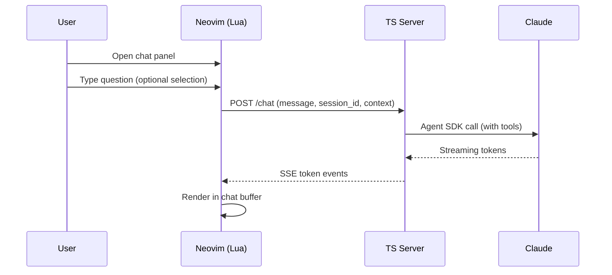

# Chat

## User Flow



1. User opens a chat panel (split or float) via command/keybind
2. User types a question, optionally with visual selection as context
3. Claude responds in the chat panel with streaming text
4. Conversation persists across messages within the panel session
5. User can reference code with `@file` mentions

## Plugin Interface

```lua
-- Additional setup options for chat:
require('bonk').setup({
  chat = {
    model = 'claude-opus-4-6',
    position = 'right',    -- 'right', 'left', 'bottom', 'float'
    width = 80,            -- columns (for left/right)
    height = 20,           -- lines (for bottom)
  },
})

-- Functions exposed:
require('bonk').chat_open()       -- open chat panel
require('bonk').chat_close()      -- close panel
require('bonk').chat_toggle()     -- toggle panel
require('bonk').chat_send()       -- send current input
require('bonk').chat_clear()      -- clear conversation
require('bonk').chat_ask(text)    -- programmatic question
```

## API: POST /chat

### Request

```json
{
  "token": "auth-uuid",
  "client_id": "nvim-12345",
  "session_id": "chat-session-abc",
  "message": "How does the fibonacci function handle negative numbers?",
  "context": {
    "file_path": "/absolute/path/to/file.ts",
    "filetype": "typescript",
    "selection": {
      "start": { "line": 0, "col": 0 },
      "end": { "line": 3, "col": 1 },
      "text": "function fibonacci(n: number): number {\n  if (n <= 1) return n;\n  return fibonacci(n - 1) + fibonacci(n - 2);\n}"
    },
    "mentions": [
      { "type": "file", "path": "/absolute/path/to/tests/fib.test.ts" }
    ]
  },
  "options": {
    "model": "claude-opus-4-6"
  }
}
```

### Response (SSE Stream)

```
event: token
data: {"text": "The current implementation"}

event: token
data: {"text": " doesn't handle negative numbers..."}

event: done
data: {"session_id": "chat-session-abc", "usage": {...}}
```

## Chat Panel Layout

```
+----------------------------+-------------------+
|                            |  Chat             |
|   Source Buffer            |                   |
|                            |  > How does the   |
|                            |    fibonacci...   |
|                            |                   |
|                            |  The current      |
|                            |  implementation   |
|                            |  doesn't handle   |
|                            |  negative...      |
|                            |                   |
|                            | [input area]      |
+----------------------------+-------------------+
```

**Buffer types:**
- **Chat display buffer:** scratch, nofile, `ft=markdown`
- **Chat input buffer:** scratch, nofile
- Messages rendered with role markers (`>` for user, no prefix for assistant)
- Syntax highlighting via treesitter markdown

## Chat Agent

```typescript
const chatAgent = {
  model: 'claude-opus-4-6',
  instructions: `You are a coding assistant embedded in Neovim. The user will ask questions about their code. You have access to their current file, selection, and referenced files.

Rules:
- Be concise and direct.
- When showing code, use markdown fences with the correct language.
- Reference specific line numbers when discussing code.
- If you need more context, say what file or function you need to see.`,
  tools: [
    'file_read',       // read any file in the repo
    'grep_search',     // search codebase
    'file_list',       // list directory contents
  ],
}
```

## Conversation Management

```typescript
interface ChatSession {
  id: string
  clientId: string
  messages: Message[]     // conversation history
  createdAt: number
  lastActiveAt: number
}
```

- Sessions are in-memory, not persisted across server restarts
- Sessions expire after 30 minutes of inactivity
- Each chat panel in Neovim gets its own session ID
- Message history is sent with each request so the Agent SDK has full context
