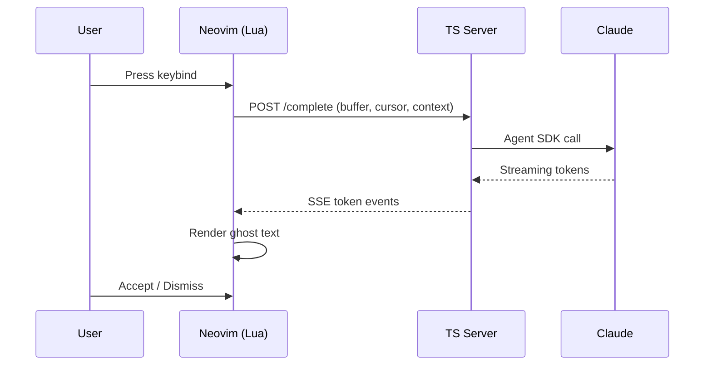

# Inline Completions

## User Flow



1. User is editing code in Neovim
2. User presses their configured keybind (e.g., `<C-Space>`)
3. Ghost text appears inline at cursor, streaming token-by-token
4. User accepts (inserts text), accepts line (inserts first line only), or dismisses

## Plugin Interface

```lua
-- All keybinds are user-configured. No defaults.
-- Example setup:
require('bonk').setup({
  server = {
    -- path to server directory (auto-detected from plugin install path)
    path = nil,
  },
  completion = {
    model = 'claude-opus-4-6',
    context_budget = 32768,
    max_tokens = 512,       -- max completion length
  },
})

-- Functions exposed for keybinding:
require('bonk').complete()       -- trigger completion
require('bonk').accept()         -- accept full ghost text
require('bonk').accept_line()    -- accept first line only
require('bonk').dismiss()        -- clear ghost text
require('bonk').cancel()         -- cancel in-flight request
```

## API: POST /complete

### Request

```json
{
  "token": "auth-uuid",
  "client_id": "nvim-12345",
  "file_path": "/absolute/path/to/file.ts",
  "filetype": "typescript",
  "buffer_content": "function fibonacci(n: number): number {\n  if (n <= 1) return n;\n  \n}",
  "cursor": {
    "line": 2,
    "col": 2
  },
  "context": {
    "open_buffers": [
      { "path": "/absolute/path/to/utils.ts", "content": "..." }
    ],
    "recent_edits": [
      { "path": "/absolute/path/to/file.ts", "diff": "@@ -1,3 +1,4 @@..." }
    ]
  },
  "options": {
    "model": "claude-opus-4-6",
    "max_tokens": 512,
    "context_budget": 32768
  }
}
```

### Response (SSE Stream)

```
event: token
data: {"text": "return"}

event: token
data: {"text": " fibonacci(n - 1)"}

event: token
data: {"text": " + fibonacci(n - 2);"}

event: done
data: {"full_text": "return fibonacci(n - 1) + fibonacci(n - 2);", "model": "claude-opus-4-6", "usage": {"input_tokens": 1234, "output_tokens": 25}}

event: error
data: {"message": "Agent SDK error: ...", "code": "SDK_ERROR"}
```

## Ghost Text Rendering

Ghost text is rendered using Neovim extmarks (`nvim_buf_set_extmark`) within a dedicated namespace.

**First line of completion:**
- `virt_text_pos = 'inline'`
- `virt_text = {{ text, 'BonkGhost' }}`

**Subsequent lines:**
- `virt_lines = { {{ text, 'BonkGhost' }} }`

**Highlight:** `BonkGhost` is linked to `Comment` by default. Users can override it in their colorscheme.

**Behavior:**
- Only one active completion at a time
- New trigger cancels any in-flight request and clears existing ghost text
- Ghost text is cleared on any buffer change (`InsertLeave`, `TextChangedI`, `CursorMovedI`)
- Accept inserts the text and clears the extmark

## Completion Agent

```typescript
const completionAgent = {
  model: 'claude-opus-4-6',
  instructions: `You are a code completion engine. Given a file with a cursor position marked by <|CURSOR|>, output ONLY the code that should be inserted at that position.

Rules:
- Output raw code only. No markdown fences. No explanations.
- Match the surrounding style, indentation, and conventions.
- Complete the logical unit: finish the statement, block, or function.
- If the cursor is mid-line, complete the rest of the line and any following lines that logically belong.
- Stop when the completion is naturally complete. Do not over-generate.
- Use context from other files and recent edits to inform your completion.`,
  // No tools -- pure completion, minimal overhead
}
```
