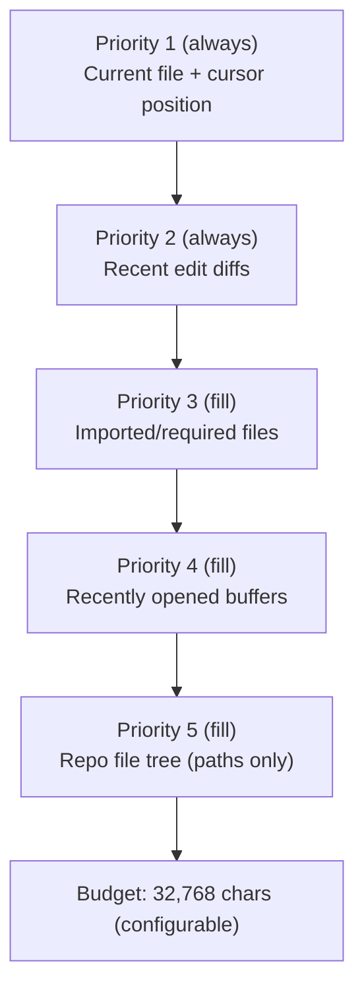

# Context Strategy

Inspired by Supermaven's approach: full repo awareness, edit tracking, prioritized context assembly.

## Repo Index

Built on server startup and kept in memory. Updated on file change notifications.

```typescript
interface RepoIndex {
  root: string                          // git root or cwd
  files: Map<string, FileEntry>         // path -> metadata
  gitignore: string[]                   // patterns to exclude
}

interface FileEntry {
  path: string          // relative to root
  size: number          // bytes
  language: string      // detected from extension
  lastModified: number  // mtime
}
```

The index is a **file tree with metadata**, not file contents. Contents are loaded on-demand during context assembly.

## Edit Tracker

Tracks buffer changes within the current session, providing Supermaven-style edit intent signals.

```typescript
interface EditTracker {
  edits: EditEntry[]    // ordered by time
  maxEntries: 100       // rolling window
}

interface EditEntry {
  path: string
  timestamp: number
  diff: string          // unified diff of the change
  cursorBefore: Position
  cursorAfter: Position
}
```

The Lua plugin sends edit diffs to the server via `POST /context/edit`. The server maintains the rolling window.

## Context Assembly

On each completion/chat request, the server assembles context by priority:



### Assembly Algorithm

1. Pack Priority 1 (mandatory, no budget check)
2. Pack Priority 2 (mandatory, no budget check)
3. For priorities 3-5, greedily fill until budget exhausted
4. Within each priority, rank by recency and relevance
5. Truncate individual files if needed to fit budget

## Import Resolution

For Priority 3 context, the server does basic import/require detection:

```
Supported patterns:
  import ... from '...'           (JS/TS)
  require('...')                  (JS/TS/Lua)
  from ... import ...             (Python)
  use ...                         (Rust)
  #include "..."                  (C/C++)
```

### Resolution Rules

- Relative paths resolved against current file
- Package imports ignored (only local files)
- Resolved paths looked up in RepoIndex
